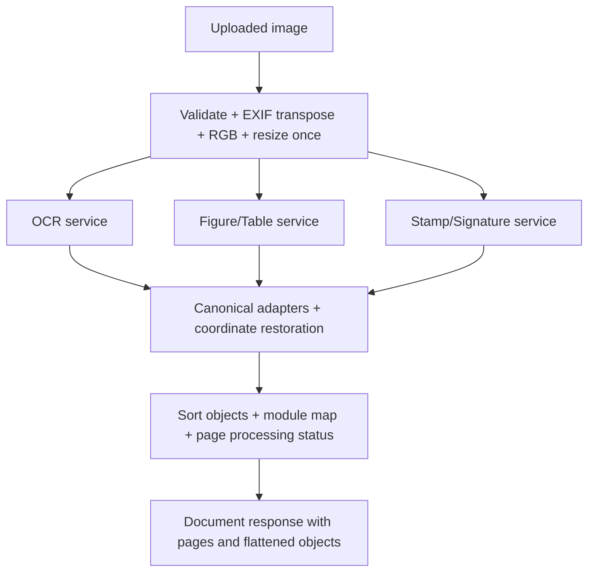

# Extraction V1 workflows

## Shared preprocessing

Every endpoint routes uploads through `prepare_uploaded_page()` and `prepare_page()`. The sequence is:

```text
Raw image bytes
      |
      +-- non-empty and <= max_upload_bytes
      +-- Pillow header open, dimensions/pixel limit, image.verify()
      v
decode again -> EXIF orientation correction -> RGB conversion
      v
PUBLIC SOURCE COORDINATE SPACE: exif_corrected_source_pixels
      v
aspect-preserving resize only when long edge > preprocess_max_long_edge
      v
processed RGB PIL image + ImageMetadata + TransformMetadata
      v
backend-specific resize / normalize / tensor layout
      v
model coordinates -> adapter inverse mapping -> public source coordinates
```

The default limits are 25 MiB per upload, 50 million pixels per image, 100 pages per document, and a 2500-pixel processed long edge. The API does not impose an aggregate multipart byte limit beyond server/proxy limits. MIME type and filename are metadata; successful Pillow decoding is the actual file-format check.

EXIF transpose is performed before `source_width` and `source_height` are recorded. Grayscale, palette, CMYK, and alpha images are converted to RGB. Resize uses Lanczos and does not pad. If no resize is needed, a copy is still produced. `scale_x = processed_width / source_width` and `scale_y = processed_height / source_height`; rounding can make the two scales slightly different.

For a processed point `(xp, yp)`, inverse mapping is `(xp / scale_x, yp / scale_y)`, clamped to source bounds. BBoxes map all four XYXY values. Polygon points map independently. Forward helpers multiply by the same scales and are covered by bbox and polygon round-trip tests.

This boundary matters because consumers display detections on the original oriented page, not an internal 2500-pixel image. A model-space box rendered without inverse mapping would be misplaced or undersized.

## Single module request

```text
one multipart image + document/page identity
        -> shared preprocessing
        -> selected service
        -> synchronous model prediction in worker thread (real backend)
        -> backend result parser
        -> V1 class filtering / paragraph grouping
        -> inverse coordinate mapping
        -> ModulePageResponse
```

Mock services generate deterministic sample objects in processed coordinates and then use the same restoration boundary. Real services return a successful module status even when they find no objects; the status warning then records `no_text_detected`, `no_figure_or_table_detected`, or `no_stamp_or_signature_detected`.

## Single-page full extraction



The three services are scheduled concurrently. Each real call is offloaded with `asyncio.to_thread`; model-specific locks can serialize same-family calls but do not prevent different model families from overlapping.

## Multi-page document

The `/extract` multipart request carries one `document_id`, repeated `images` fields, optional document metadata, and an optional descriptor array aligned by upload position.

```text
Document DOC-100
├── image 1 + descriptor 1 -> page_id DOC-100:p1, page_number 1
├── image 2 + descriptor 2 -> page_id DOC-100:p2, page_number 2
└── image N + descriptor N -> page_id DOC-100:pN, page_number N

All uploads validate/preprocess sequentially exactly once
        |
        v
up to page_concurrency page jobs admitted
        |
        +-- Page 1: OCR -----------+
        |           layout --------+--> PageExtractionResponse
        |           marks ---------+
        +-- Page 2: same three services
        +-- ...
        v
sort pages by page_number
flatten and sort canonical objects (provenance retained)
count all ObjectType values
derive document processing status and warnings
        v
DocumentExtractionResponse
```

Input position is meaningful because it supplies the fallback `page_number` and aligns images with descriptors. A descriptor may override `page_id`, `page_number`, filename, and arbitrary metadata. If omitted, page numbers are 1..N and IDs are `<document_id>:p<page_number>`. The implementation does not reject duplicate page IDs or numbers. Results are sorted by page number; Python's stable sort preserves relative order for duplicate numbers.

Each page holds the same decoded source/processed Pillow images while its three modules run; preprocessing is not repeated per model. All pages are prepared before any inference begins. Therefore one invalid upload aborts the request with `422`; already-prepared pages are not returned or inferred.

## OCR paragraph construction

Paddle returns recognized lines. The backend rejects blank text and confidence below `ocr_score_threshold`, creates line bboxes/polygons, then sorts by `(y1, x1)`. Wiki Hami—not Paddle—creates V1 paragraphs:

1. Compute the median line height and `max_gap = median_height * ocr_paragraph_max_gap_ratio` (default 1.8).
2. Walk lines in top-to-bottom/left-to-right order.
3. Append a line to the current group when its vertical gap from the previous line is between `-median_height` and `max_gap`, and its x-overlap with the current group's union box divided by the smaller width is at least `ocr_paragraph_min_x_overlap` (default 0.15).
4. Otherwise start a new group.
5. Use the union bbox and an axis-aligned rectangular polygon for the paragraph.
6. Preserve newline-joined source text in `raw_text`; `text` trims each non-empty line's edges only.
7. Compute confidence as bbox-area-weighted mean line confidence.

This is conservative geometry grouping, not semantic section reconstruction or language-model processing.

## Failure and timeout workflow

For `/extract`, `asyncio.wait_for` applies the configured timeout independently to each module/page call. `asyncio.gather(..., return_exceptions=True)` converts exceptions into failed module statuses. Other module objects remain in the page and document. Warnings are accumulated without deduplication, so the document list can repeat a warning for multiple pages.

| Scenario | HTTP | Result |
|---|---:|---|
| Invalid multipart/JSON/page descriptor | 422 | No canonical response |
| Any invalid/corrupt/oversized page | 422 | Whole request rejected before inference |
| One module fails/times out on one page | 200 | Page/document usually `partial_success`; other objects preserved |
| All three modules fail on one page, other page succeeds | 200 | Failed page; document `partial_success` |
| All modules fail on every page | 200 | Document `failed` |
| Backend failure on an independent module endpoint | 500 | No `ModulePageResponse` recovery envelope |

Failed module statuses currently report `duration_ms: 0`, omit backend/model fields, and put `ExceptionType: message` in `error`. A timed-out worker-thread inference may continue in the background until the underlying synchronous call returns.
